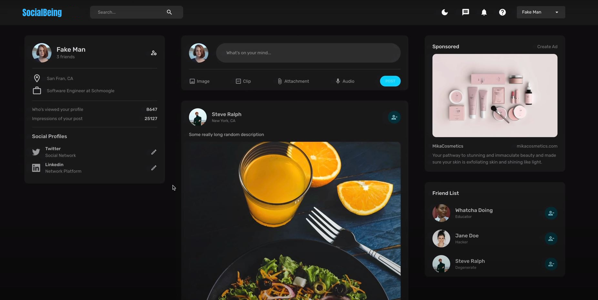
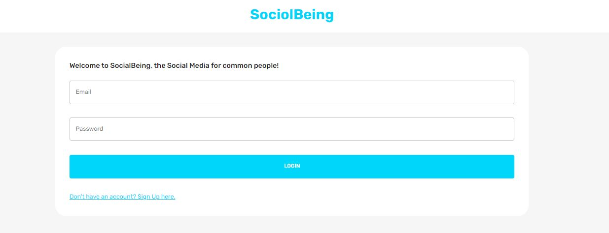

<p align="center">
  <h1 align="center">SocialBeing - Social Media App</h1>
  <p align="center">
    A simple light-weight Social Media app built with Love <3.
    <br />
    <a href="https://github.com/akash-dutta-dev/BloggerApp/issues">Report Bug</a>
    ·
    <a href="https://github.com/akash-dutta-dev/BloggerApp/issues">Request Feature</a>
  </p>
  <a href="#">
    
  </a>

</p>
 <br>     
      
<!-- TABLE OF CONTENTS -->
# Table of content
<details open="open">
  <summary>List</summary>
  <ol>
    <li><a href="#about-the-project">About The Project</a></li>
    <li><a href="#features">Features</a></li>
    <li><a href="#built-with">Built with</a></li>
    <li><a href="#installation">Installation</a></li>
    <li><a href="#contributing">Contributing</a></li>
    <li><a href="#license">License</a></li>
    <li><a href="#contact">Contact</a></li>
  </ol>
</details>

<!-- ABOUT THE PROJECT -->

# About The Project

Hey there, welcome to SocialBeing – the social media app that's all about secure & real connections and authentic sharing. Imagine a place where you can connect with others, share your experiences, or just be yourself. That's what SocialBeing is all about!
<br><br>


# Features

- User Profiles: Create and customize your profile with bio, profile picture, and personal information.
- News Feed: Scroll through a personalized feed of updates, posts, and activities from friends and communities.
- Multimedia Sharing: Share photos, videos, and audio clips to express yourself creatively.
- Like and Comment: Interact with posts by liking and leaving comments to show appreciation or share thoughts.
- Friend Requests: Connect with others by sending and accepting friend requests.
- Direct Messaging: Chat privately with friends through one-on-one or group messaging.
- Notifications: Receive real-time alerts for likes, comments, friend requests, and more.
- Privacy Settings: Control who sees your content with customizable privacy options for posts and profiles.
- Explore Page: Discover new people, content, and communities based on interests and trends.
- Groups and Communities: Join or create groups centered around shared interests or activities.
- Reactions: React to posts with a variety of emoticons to express feelings beyond a simple like.
- Hashtags: Organize and discover content using hashtags that represent trending topics or themes.
- Search Functionality: Easily find friends, content, and communities with a robust search feature.
- Dark Mode: Toggle between light and dark modes for personalized visual preferences.
- Emoji Keyboard: Express yourself with a wide range of emojis in comments and messages.
- <i>more coming soon!!</i>

# Built With

## FrontEnd

- React
- Redux
- Material UI
- Javascript
- SCSS/CSS
- HTML

## Backend

- NodeJs
- ExpressJs
- Mongoose
- Jwt Token

## Database

- MongoDB

<!-- Installation -->

# Installation

- Creaet a account in MongoDB Atlas and create a cluster
- Clone the code and configure the `backend/index.js` to connect your cluster server.
- Then execute the following commands.

```
// For backend,
cd backend
npm install
node index.js

// For frontend
cd frontend
npm install
npm run dev
```

- The project will start running at `http://localhost:3000/`
- For new sign-ups, a few sample posts will be automatically created.
- That's it. Enjoy.
  <br>

Let me know if you face any errors or issues.

<!-- CONTRIBUTING -->

# Contributing

Contributions are what make the open-source community such an amazing place to learn, inspire, and create. Any contributions you make are **greatly appreciated**.

1. Fork the Project
2. Create your Feature Branch (`git checkout -b feature/AmazingFeature`)
3. Commit your Changes (`git commit -m 'Add some AmazingFeature'`)
4. Push to the Branch (`git push origin feature/AmazingFeature`)
5. Open a Pull Request

<!-- LICENSE -->

# License

Distributed under the MIT License. See `LICENSE` for more information.

<!-- CONTACT -->

# Contact

Email - akash.dutta9830489799@gmail.com

LinkedIn - https://www.linkedin.com/in/akash-dutta/

Instgram - https://www.instagram.com/akash_dutta97
